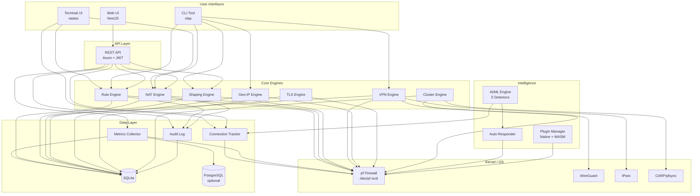
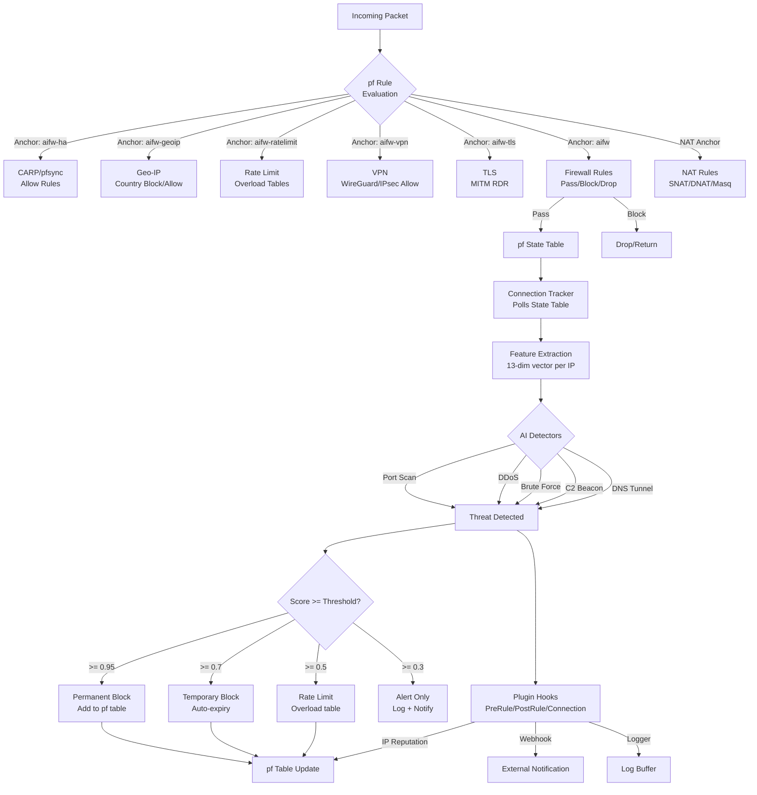
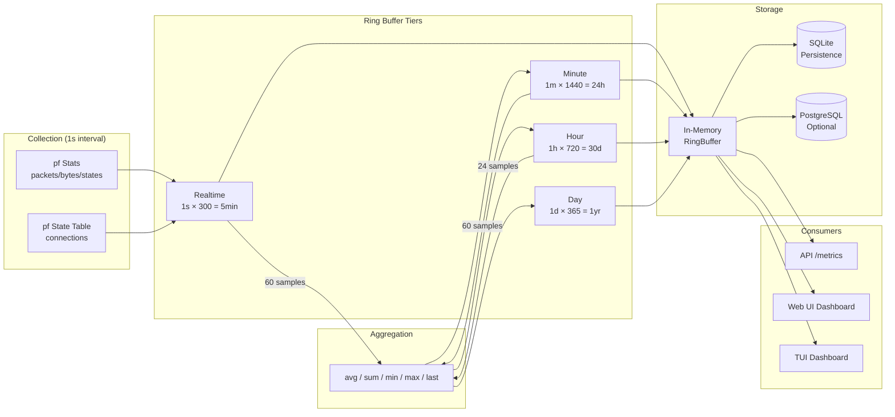
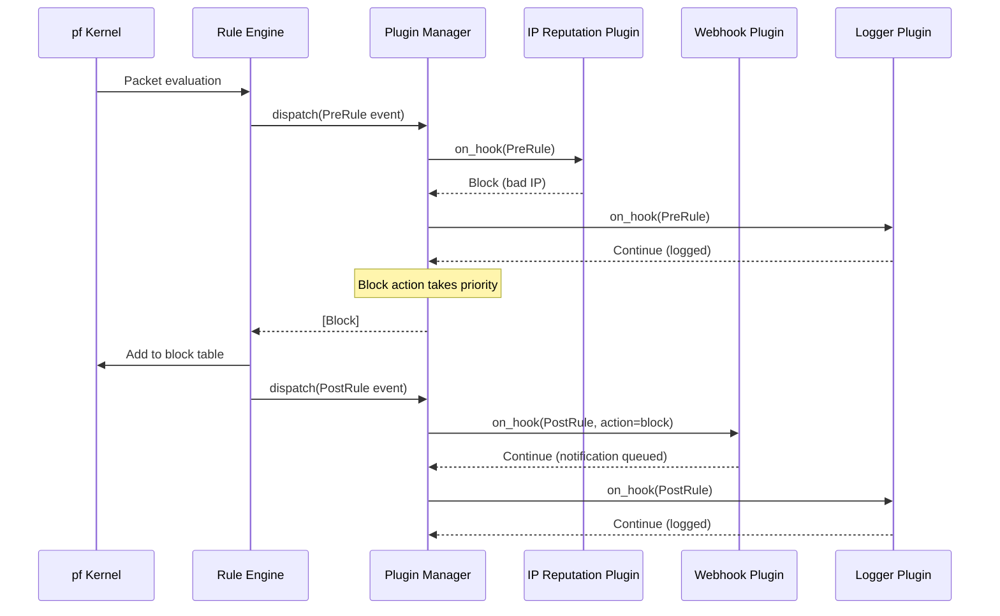
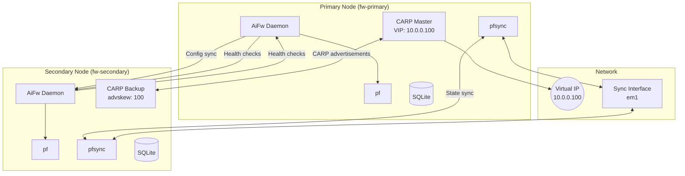

# AiFw — System Architecture & Data Flow

## High-Level Architecture

```mermaid
graph TB
    subgraph "User Interfaces"
        UI[Web UI<br/>NextJS]
        TUI[Terminal UI<br/>ratatui]
        CLI[CLI Tool<br/>clap]
    end

    subgraph "API Layer"
        API[REST API<br/>Axum + JWT]
    end

    subgraph "Core Engines"
        RE[Rule Engine]
        NE[NAT Engine]
        SE[Shaping Engine]
        VE[VPN Engine]
        GE[Geo-IP Engine]
        TE[TLS Engine]
        CE[Cluster Engine]
    end

    subgraph "Intelligence"
        AI[AI/ML Engine<br/>5 Detectors]
        PM[Plugin Manager<br/>Native + WASM]
        AR[Auto-Responder]
    end

    subgraph "Data Layer"
        CT[Connection Tracker]
        MC[Metrics Collector]
        AL[Audit Log]
        DB[(SQLite)]
        PG[(PostgreSQL<br/>optional)]
    end

    subgraph "Kernel / OS"
        PF[pf Firewall<br/>/dev/pf ioctl]
        WG[WireGuard]
        IPSEC[IPsec]
        CARP[CARP/pfsync]
    end

    UI --> API
    TUI --> RE & NE & CT
    CLI --> RE & NE & SE & VE & GE

    API --> RE & NE & SE & CT & AL & MC

    RE --> PF
    NE --> PF
    SE --> PF
    VE --> PF & WG & IPSEC
    GE --> PF
    TE --> PF
    CE --> PF & CARP

    AI --> CT
    AI --> AR
    AR --> PF
    PM --> PF

    CT --> PF
    MC --> PF
    MC --> DB
    MC --> PG

    RE & NE & SE & VE & GE & TE & CE --> DB
    RE & NE --> AL
    AL --> DB
```

## Packet Processing Flow

```mermaid
flowchart TD
    PKT[Incoming Packet] --> PF_EVAL{pf Rule<br/>Evaluation}

    PF_EVAL -->|Anchor: aifw-ha| HA_RULES[CARP/pfsync<br/>Allow Rules]
    PF_EVAL -->|Anchor: aifw-geoip| GEO_RULES[Geo-IP<br/>Country Block/Allow]
    PF_EVAL -->|Anchor: aifw-ratelimit| RL_RULES[Rate Limit<br/>Overload Tables]
    PF_EVAL -->|Anchor: aifw-vpn| VPN_RULES[VPN<br/>WireGuard/IPsec Allow]
    PF_EVAL -->|Anchor: aifw-tls| TLS_RULES[TLS<br/>MITM RDR]
    PF_EVAL -->|Anchor: aifw| FW_RULES[Firewall Rules<br/>Pass/Block/Drop]
    PF_EVAL -->|NAT Anchor| NAT_RULES[NAT Rules<br/>SNAT/DNAT/Masq]

    FW_RULES -->|Pass| STATE[pf State Table]
    FW_RULES -->|Block| DROP[Drop/Return]

    STATE --> CT_POLL[Connection Tracker<br/>Polls State Table]
    CT_POLL --> FEATURES[Feature Extraction<br/>13-dim vector per IP]
    FEATURES --> DETECTORS{AI Detectors}

    DETECTORS -->|Port Scan| THREAT[Threat Detected]
    DETECTORS -->|DDoS| THREAT
    DETECTORS -->|Brute Force| THREAT
    DETECTORS -->|C2 Beacon| THREAT
    DETECTORS -->|DNS Tunnel| THREAT

    THREAT --> SCORE{Score >= Threshold?}
    SCORE -->|>= 0.95| PERM_BLOCK[Permanent Block<br/>Add to pf table]
    SCORE -->|>= 0.7| TEMP_BLOCK[Temporary Block<br/>Auto-expiry]
    SCORE -->|>= 0.5| RATE_LIMIT[Rate Limit<br/>Overload table]
    SCORE -->|>= 0.3| ALERT[Alert Only<br/>Log + Notify]

    PERM_BLOCK --> PF_TABLE[pf Table Update]
    TEMP_BLOCK --> PF_TABLE
    RATE_LIMIT --> PF_TABLE

    THREAT --> PLUGINS[Plugin Hooks<br/>PreRule/PostRule/Connection]
    PLUGINS -->|IP Reputation| PF_TABLE
    PLUGINS -->|Webhook| NOTIFY[External Notification]
    PLUGINS -->|Logger| LOG_BUF[Log Buffer]
```

## Metrics Collection Flow

```mermaid
flowchart LR
    subgraph "Collection (1s interval)"
        PF_STATS[pf Stats<br/>packets/bytes/states]
        PF_STATES[pf State Table<br/>connections]
    end

    subgraph "Ring Buffer Tiers"
        T1[Realtime<br/>1s × 300 = 5min]
        T2[Minute<br/>1m × 1440 = 24h]
        T3[Hour<br/>1h × 720 = 30d]
        T4[Day<br/>1d × 365 = 1yr]
    end

    subgraph "Aggregation"
        AGG[avg / sum / min / max / last]
    end

    subgraph "Storage"
        MEM[In-Memory<br/>RingBuffer]
        SQLite[(SQLite<br/>Persistence)]
        PG[(PostgreSQL<br/>Optional)]
    end

    subgraph "Consumers"
        API_Q[API /metrics]
        UI_D[Web UI Dashboard]
        TUI_D[TUI Dashboard]
    end

    PF_STATS --> T1
    PF_STATES --> T1
    T1 -->|60 samples| AGG --> T2
    T2 -->|60 samples| AGG --> T3
    T3 -->|24 samples| AGG --> T4

    T1 & T2 & T3 & T4 --> MEM
    MEM --> SQLite
    MEM --> PG

    MEM --> API_Q
    MEM --> UI_D
    MEM --> TUI_D
```

## Plugin Hook Flow

```mermaid
sequenceDiagram
    participant PF as pf Kernel
    participant Engine as Rule Engine
    participant PM as Plugin Manager
    participant IP as IP Reputation Plugin
    participant WH as Webhook Plugin
    participant LOG as Logger Plugin

    PF->>Engine: Packet evaluation
    Engine->>PM: dispatch(PreRule event)
    PM->>IP: on_hook(PreRule)
    IP-->>PM: Block (bad IP)
    PM->>LOG: on_hook(PreRule)
    LOG-->>PM: Continue (logged)

    Note over PM: Block action takes priority

    PM-->>Engine: [Block]
    Engine->>PF: Add to block table

    Engine->>PM: dispatch(PostRule event)
    PM->>WH: on_hook(PostRule, action=block)
    WH-->>PM: Continue (notification queued)
    PM->>LOG: on_hook(PostRule)
    LOG-->>PM: Continue (logged)
```

## High Availability Flow

```mermaid
flowchart TB
    subgraph "Primary Node (fw-primary)"
        P_AIFW[AiFw Daemon]
        P_PF[pf]
        P_CARP[CARP Master<br/>VIP: 10.0.0.100]
        P_PFSYNC[pfsync]
        P_DB[(SQLite)]
    end

    subgraph "Secondary Node (fw-secondary)"
        S_AIFW[AiFw Daemon]
        S_PF[pf]
        S_CARP[CARP Backup<br/>advskew: 100]
        S_PFSYNC[pfsync]
        S_DB[(SQLite)]
    end

    subgraph "Network"
        VIP((Virtual IP<br/>10.0.0.100))
        SYNC[Sync Interface<br/>em1]
    end

    P_CARP <-->|CARP advertisements| S_CARP
    P_PFSYNC <-->|State sync| S_PFSYNC
    P_PFSYNC <--> SYNC <--> S_PFSYNC

    P_CARP --> VIP
    P_AIFW -->|Config sync| S_AIFW

    P_AIFW --> P_PF
    S_AIFW --> S_PF

    P_AIFW -->|Health checks| S_AIFW
    S_AIFW -->|Health checks| P_AIFW
```
